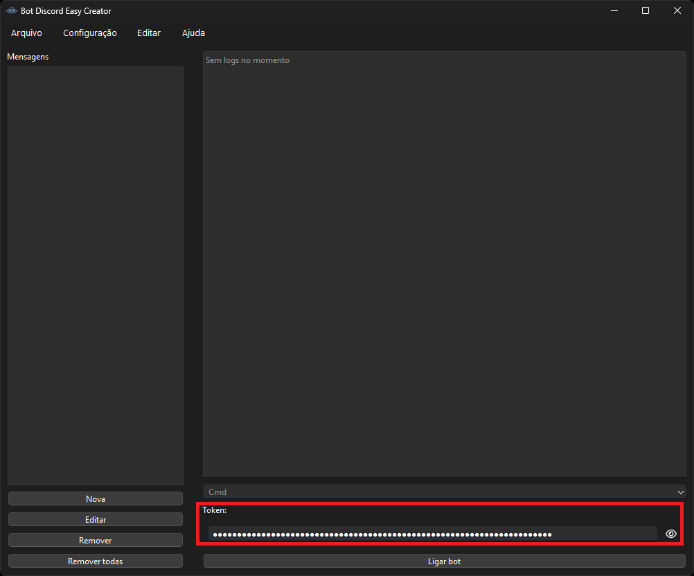
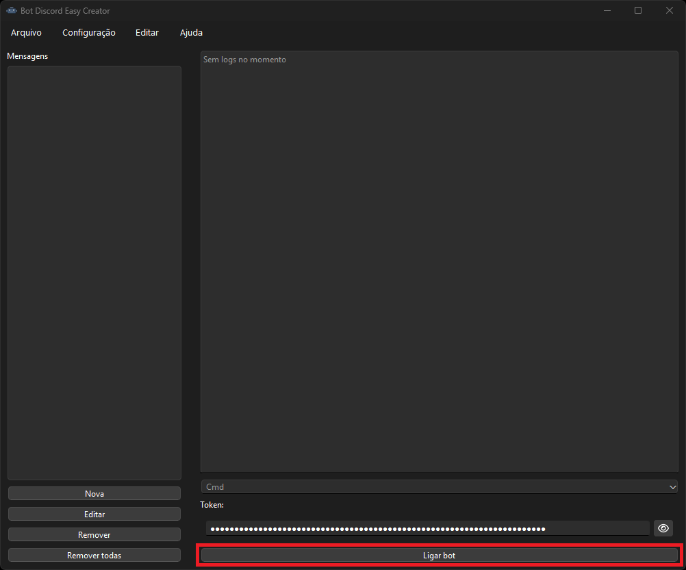

<p style="text-align: center;">
  
</p>

# Discord Bot Creator

## Sobre:

**Discord Bot Creator**, é um ‘software’ gratuito para criação de ‘bots’ no Discord, com uma ‘interface’ interativa capaz
de executar o ‘bot’.

## Como iniciar:

### 1.º Passo: Instalando dependências e bibliotecas

##### Linguagens:

* [Python 3.13.3](https://www.python.org/downloads/release/python-3133/)

#### Instalação:

Abra o cmd e digite:

```bash
pip install -r requirements.txt
```

Esse processo pode ser realizado a partir da ‘interface’.

### 2.º Passo: Interface

Para iniciar a interface do bot, digite no cmd:

```bash
python main.py
```

### 3.º Passo: Inserindo o token

Para inserir o token, clique no campo Token da interface, insira e aperte Enter para salvar.



Se preferir pode copiar o token do seu bot e inserir no arquivo config.yaml, por exemplo:

```yaml
token: <seu token>
```

### 4.º Passo: Iniciando ‘Bot’

Para iniciar o ‘Bot’ basta clicar no botão Ligar ‘Bot’:



Ou se já tiver uma configuração de mensagens e desejar executar o ‘bot’ separadamente, digite no cmd:

```bash
python bot.py
```

## Não tem um ‘token’?

### Para vincular o seu ‘bot’ ao Discord, siga este passo a passo:

* Acesse o site do desenvolvedor do [Discord](https://discord.com/developers) e clique em "Applications", 
  depois selecione "New Application".
* Dê um nome ao seu ‘bot’ e clique em "Create". Você será redirecionado para um painel onde poderá adicionar mais 
  informações, como imagem, descrição e tags.
* No menu à esquerda, clique na opção "Bot" e, em seguida, em "Add Bot".

Após a criação você deve encontrar o ‘Token’ na mesma pagina.

## Modificando o bot:

### Janela inicial:

Na janela inicial podemos criar, editar, excluir e visualizar as mensagens que configuramos,
podemos também executar o bot e visualizar as mensagens de retorno (logs).

Ao clicar no botão de adicionar ou editar podemos visualizar uma nova janela.

### Janela de edição:

Nessa janela podemos criar ou editar uma mensagem, que configura como o ‘Bot’ deve reagir às mensagens enviadas no
servidor ou privado. Agora vamos introduzir como podem ser utilizados os cinco campos de preenchimento:

* **Nome**: O nome que deseja salvar essa mensagem.
* **Mensagem esperada**: Mensagem que será utilizada pelas condições de "expected message" e "not expected message", nesse
  campo se tivermos mais de uma mensagem, todas serão enviadas, separando uma mensagem com ¨ podemos definir mensagens
  aleatórias.
* **Resposta**: São as mensagens que devemos enviar como reposta caso todas as condições forem satisfeitas.
* **Reações**: O ‘bot’ irá reagir com todas as reações definidas.
* **Condições**: Define condições as mensagens que deverão ser respondidas.

#### Configurando a resposta:

Podemos configurar as "formas" de resposta, como:

* Resposta no grupo ou privada.
* Banimento ou expulsão como resposta.
* Onde serão adicionadas as reações (‘bot’ ou utilizador).
* Delay na resposta.
* Remover ou fixar a mensagem.

# Para desenvolvedores:

## Desenvolvendo traduções:

Para iniciar o desenvolvimento de traduções, você precisa ter o **Qt Linguist** instalado (O Qt Linguist deve estar na 
pasta do Qt), pois iremos utilizá-lo para traduzir cada widget da ‘interface’.
Vamos começar gerando os arquivos .ts a partir das ‘interfaces’, exemplo:
    
```bash
pyside6-lupdate -extensions py .venv/Lib/site-packages/extra_qwidgets ./views ./controllers ./core ./widgets ./interpreter -ts translations/pt_br.ts 
pyside6-lupdate -extensions py .venv/Lib/site-packages/extra_qwidgets ./views ./controllers ./core ./widgets ./interpreter -ts translations/en_us.ts
```

Agora abra o arquivo .ts gerado e traduza cada widget, após isso, compile o arquivo com o comando:

```bash
pyside6-lrelease translations/pt_br.ts -qm translations/build/pt_br.qm
pyside6-lrelease translations/en_us.ts -qm translations/build/en_us.qm
```

## Compilando:

Para compilar o programa, basta executar o seguinte comando:
```bash
python setup.py build
```
Mais configurações podem ser realizadas no setup.py.